# RailroadDiagrams

[](https://rubygems.org/gems/railroad_diagrams)

Generate railroad syntax diagrams as SVG or fixed-width text with Ruby 2.5 or newer. Inspired by [railroad-diagrams](https://github.com/tabatkins/railroad-diagrams).

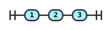

## Install

```bash
gem install railroad_diagrams
```

Or add `gem 'railroad_diagrams'` to your Gemfile and run `bundle install`.

## Quick start

```ruby
require 'railroad_diagrams'

diagram = RailroadDiagrams::Diagram.new('SELECT', RailroadDiagrams::Optional.new('DISTINCT'))
File.write('select.svg', diagram.to_standalone_svg)
```

`to_standalone_svg` includes CSS. Use `to_svg` to embed the diagram in a page with your own CSS. Both methods return strings; `write_svg` and `write_standalone` write to an IO, a String, or a callable. Pass `max_width: 600` to wrap a long sequence across rows.

Select a built-in theme with `to_standalone_svg(theme: :dark)` or use `theme: :auto` to follow the viewer's color scheme. Pass `inline_styles: true` when the destination strips SVG style elements. `to_html(title: 'Syntax')` returns a complete HTML page. For screen readers, pass `title:` and `desc: :auto` to `Diagram.new`; `to_svg(locale: :ja)` produces a Japanese description. Links in `to_svg` allow HTTP, HTTPS, email, and relative URLs by default.

## Nodes

Strings passed as children become `Terminal` nodes. Build larger diagrams by nesting the constructors below. See [examples/demo.rb](examples/demo.rb) for complete diagrams.

| Node | Example | Preview |
| --- | --- | --- |
| `Terminal` | `Terminal.new('word')` |  |
| `NonTerminal` | `NonTerminal.new('expression')` | 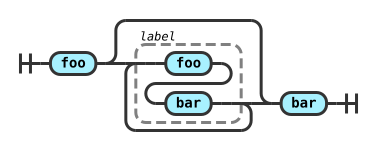 |
| `Comment` | `Comment.new('note')` | 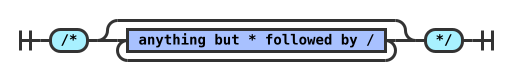 |
| `Sequence` | `Sequence.new('a', 'b')` |  |
| `Stack` | `Stack.new('a', 'b')` | 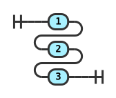 |
| `Choice` | `Choice.new(0, 'a', 'b')` | 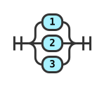 |
| `Optional` | `Optional.new('a')` | 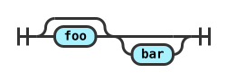 |
| `OneOrMore` | `OneOrMore.new('a', ',')` | 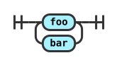 |
| `ZeroOrMore` | `ZeroOrMore.new('a', ',')` | 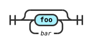 |
| `Group` | `Group.new('a', label: 'label')` | 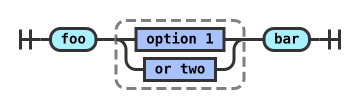 |
| `HorizontalChoice` | `HorizontalChoice.new('a', 'b')` | 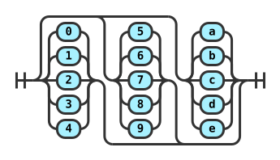 |
| `OptionalSequence` | `OptionalSequence.new('a', 'b')` | 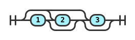 |
| `AlternatingSequence` | `AlternatingSequence.new('a', 'b')` | 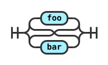 |
| `MultipleChoice` | `MultipleChoice.new(0, 'any', 'a', 'b')` | 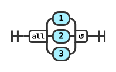 |
| `Skip`, `Start`, `End` | `Skip.new`, `Start.new`, `End.new` | 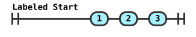 |
| `ComplexDiagram` | `ComplexDiagram.new('item')` |  |
| `Block` | `Block.new(width: 50)` | 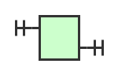 |
| `Repeat` | `Repeat.new('item', min: 2, max: 4)` | 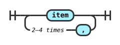 |
| `SeparatedList` | `SeparatedList.new('item', ',')` | 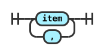 |
| `Except` | `Except.new('letter', '[0-9]')` | 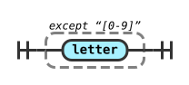 |
| `CharClass` | `CharClass.new('[a-z]')` | 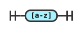 |
| `Special` | `Special.new('any character')` | 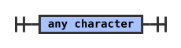 |

`Optional` is a `Choice` subclass, and `ZeroOrMore` is an `Optional` subclass. `HorizontalChoice.new` and `OptionalSequence.new` return a `Sequence` when passed zero or one child.

## Builder and structured data

```ruby
diagram = RailroadDiagrams.diagram do
  seq('SELECT', opt('DISTINCT'), nt(:table))
end

json = diagram.to_json
same_diagram = RailroadDiagrams.from_json(json)
puts same_diagram == diagram
```

The builder converts strings to terminals, symbols to nonterminals, nil to `Skip`, and arrays to `Sequence`. Direct constructors keep their existing conversion rules. `RailroadDiagrams.build` returns a node; a block with one argument receives the builder. The [DSL demo](examples/demo_dsl.rb) matches all bundled diagrams. `to_h`, `from_h`, `to_yaml`, and `from_yaml` use the [version 1 schema](schema/v1.json). `each_node` walks the tree in depth-first order.

## Text output

```ruby
puts diagram.to_text                       # Unicode box characters
puts diagram.to_text(charset: :ascii)       # ASCII only
puts diagram.to_text(charset: :unicode_square, strip_trailing: true)
puts diagram.to_text(escape_html: true)     # safe to embed in HTML
puts diagram.to_markdown                     # fenced code block
```

Labels use Unicode display widths, so CJK and emoji fit their boxes. Ambiguous-width characters occupy one column. The older `write_text` method escapes HTML by default for compatibility.

## Demo CLI

`railroad_diagrams --format=svg > demo.html` writes an HTML page containing the bundled examples. Formats: `svg`, `standalone`, `ascii`, and `unicode`. Pass example names after the options to select diagrams. `--max-width 600` wraps SVG examples. This command runs the bundled demo; use the Ruby API for your own diagrams.

## Configuration and compatibility

The constants in [lib/railroad_diagrams.rb](lib/railroad_diagrams.rb), including `VS`, `AR`, `CHAR_WIDTH`, and `INTERNAL_ALIGNMENT`, remain available for compatibility. Pass options such as `arc_radius:`, `char_width:`, and `theme:` to individual output calls. `Style.default_style` returns the default CSS. `to_text(charset:)` uses per-call state and is safe to call from multiple threads.

Read the [migration guide](docs/migration.md) for behavior changes and deprecations. Before 1.0, breaking changes receive at least one minor release of deprecation notice; removal is deferred to 2.0.

## Development and releases

Run `bin/setup`, then `bundle exec rake` for specs and type checking. `bundle exec rake golden:update` regenerates golden outputs; review those diffs before committing. `bundle exec rake docs:images` copies the reviewed SVG outputs into the node gallery. `bin/console` opens an IRB session.

To release, update `lib/railroad_diagrams/version.rb` and `CHANGELOG.md`, run the test suite, then push a matching `vX.Y.Z` tag. The [release workflow](.github/workflows/release.yml) publishes the gem through RubyGems Trusted Publishing and creates a GitHub release.

See [CONTRIBUTING.md](CONTRIBUTING.md) for changes and [SECURITY.md](SECURITY.md) for vulnerability reports. Licensed under [MIT](LICENSE.txt).
