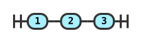

# RailroadDiagrams

[](https://rubygems.org/gems/railroad_diagrams)

Generate railroad syntax diagrams as SVG or fixed-width text with Ruby 2.5 or newer. Inspired by [railroad-diagrams](https://github.com/tabatkins/railroad-diagrams).



## Install

```bash
gem install railroad_diagrams
```

Or add `gem 'railroad_diagrams'` to your Gemfile and run `bundle install`.

## Quick start

```ruby
require 'railroad_diagrams'

diagram = RailroadDiagrams::Diagram.new('SELECT', RailroadDiagrams::Optional.new('DISTINCT'))
File.write('select.svg', diagram.to_standalone_svg)
```

`to_standalone_svg` includes CSS. Use `to_svg` to embed the diagram in a page with your own CSS. Both methods return strings; `write_svg` and `write_standalone` write to an IO, a String, or a callable.

## Nodes

Strings passed as children become `Terminal` nodes. Build larger diagrams by nesting the constructors below. See [examples/demo.rb](examples/demo.rb) for complete diagrams.

| Node | Example | Preview |
| --- | --- | --- |
| `Terminal` | `Terminal.new('word')` | [terminal](spec/golden/simple/standalone.svg) |
| `NonTerminal` | `NonTerminal.new('expression')` | [nonterminal](spec/golden/Group_example/standalone.svg) |
| `Comment` | `Comment.new('note')` | [comment](spec/golden/comment/standalone.svg) |
| `Sequence` | `Sequence.new('a', 'b')` | [sequence](spec/golden/rrx2Dsequence/standalone.svg) |
| `Stack` | `Stack.new('a', 'b')` | [stack](spec/golden/rrx2Dstack/standalone.svg) |
| `Choice` | `Choice.new(0, 'a', 'b')` | [choice](spec/golden/rrx2Dchoice/standalone.svg) |
| `Optional` | `Optional.new('a')` | [optional](spec/golden/rrx2Doptional/standalone.svg) |
| `OneOrMore` | `OneOrMore.new('a', ',')` | [one or more](spec/golden/rrx2Doneormore/standalone.svg) |
| `ZeroOrMore` | `ZeroOrMore.new('a', ',')` | [zero or more](spec/golden/rrx2Dzeroormorex2D1/standalone.svg) |
| `Group` | `Group.new('a', 'label')` | [group](spec/golden/rrx2Dgroup/standalone.svg) |
| `HorizontalChoice` | `HorizontalChoice.new('a', 'b')` | [horizontal choice](spec/golden/rrx2Dhorizontalchoice/standalone.svg) |
| `OptionalSequence` | `OptionalSequence.new('a', 'b')` | [optional sequence](spec/golden/rrx2Doptionalsequence/standalone.svg) |
| `AlternatingSequence` | `AlternatingSequence.new('a', 'b')` | [alternating sequence](spec/golden/rrx2Dalternatingsequence/standalone.svg) |
| `MultipleChoice` | `MultipleChoice.new(0, 'any', 'a', 'b')` | [multiple choice](spec/golden/rrx2Dmultchoice/standalone.svg) |
| `Skip`, `Start`, `End` | `Skip.new`, `Start.new`, `End.new` | [start and end](spec/golden/labeledx2Dstart/standalone.svg) |

`Optional.new` and `ZeroOrMore.new` return a `Choice`. `HorizontalChoice.new` and `OptionalSequence.new` return a `Sequence` when passed zero or one child. These factory return types are part of the current API.

## Text output

```ruby
puts diagram.to_text                       # Unicode box characters
puts diagram.to_text(charset: :ascii)       # ASCII only
puts diagram.to_text(escape_html: true)     # safe to embed in HTML
```

Labels use Unicode display widths, so CJK and emoji fit their boxes. Ambiguous-width characters occupy one column. The older `write_text` method escapes HTML by default for compatibility.

## Demo CLI

`railroad_diagrams --format=svg > demo.html` writes an HTML page containing the bundled examples. Formats: `svg`, `standalone`, `ascii`, and `unicode`. Pass example names after the options to select diagrams. This command runs the bundled demo; use the Ruby API for your own diagrams.

## Configuration and compatibility

The constants in [lib/railroad_diagrams.rb](lib/railroad_diagrams.rb), including `VS`, `AR`, `CHAR_WIDTH`, and `INTERNAL_ALIGNMENT`, control drawing defaults. `Style.default_style` returns the default CSS. The text character set is global for the older `write_text` API; `to_text(charset:)` selects it for a single call but is not thread safe yet.

Read the [migration guide](docs/migration.md) for behavior changes and deprecations. Before 1.0, breaking changes receive at least one minor release of deprecation notice; removal is deferred to 2.0.

## Development and releases

Run `bin/setup`, then `bundle exec rake` for specs and type checking. `bundle exec rake golden:update` regenerates golden outputs; review those diffs before committing. `bin/console` opens an IRB session.

To release, update `lib/railroad_diagrams/version.rb` and `CHANGELOG.md`, run the test suite, then push a matching `vX.Y.Z` tag. The [release workflow](.github/workflows/release.yml) publishes the gem through RubyGems Trusted Publishing and creates a GitHub release.

See [CONTRIBUTING.md](CONTRIBUTING.md) for changes and [SECURITY.md](SECURITY.md) for vulnerability reports. Licensed under [MIT](LICENSE.txt).
