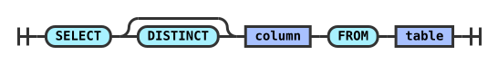

<h1 align="center">RailroadDiagrams</h1>

<p align="center">
  <strong>Railroad syntax diagrams in SVG and text, built with Ruby.</strong>
</p>

<p align="center">
  <a href="https://rubygems.org/gems/railroad_diagrams"></a>
  <a href="https://github.com/ydah/railroad_diagrams/actions/workflows/main.yml"></a>
  
  <a href="LICENSE.txt"></a>
</p>

<p align="center">
  <a href="#features">Features</a> ·
  <a href="#installation">Installation</a> ·
  <a href="#quick-start">Quick start</a> ·
  <a href="https://ydah.github.io/railroad_diagrams/guide/">User Guide</a> ·
  <a href="https://ydah.github.io/railroad_diagrams/playground.html">Playground</a>
</p>

---

Build syntax diagrams for parsers, language documentation, and grammar tools.
Compose nodes with Ruby constructors or a builder DSL, then export SVG, HTML,
or fixed-width text. Runs on Ruby 2.5 or later with no runtime gem dependencies.
Inspired by [railroad-diagrams](https://github.com/tabatkins/railroad-diagrams).



## Features

- Sequences, alternatives, optional branches, repetitions, separated lists, and character classes
- SVG, standalone HTML, and Unicode or ASCII text with CJK and emoji display widths
- Six built-in themes, width-limited wrapping, links, and accessible descriptions
- Linked grammar documents with rule navigation, reverse references, search, and lint findings
- W3C EBNF, YAML, JSON, and Ruby DSL input through the CLI
- Structural JSON/YAML serialization, a documented stable 1.x API, and RBS declarations
- A Rails view helper and separate [Jekyll](integrations/jekyll-railroad/) and [Asciidoctor](integrations/asciidoctor-railroad/) adapter projects

## Installation

```sh
gem install railroad_diagrams
```

Or add it to your Gemfile and run `bundle install`:

```ruby
gem "railroad_diagrams"
```

## Quick start

Save this as `select.rb`:

```ruby
require "railroad_diagrams"

diagram = RailroadDiagrams.diagram do
  seq("SELECT", opt("DISTINCT"), nt("column"), "FROM", nt("table"))
end

File.write("select.svg", diagram.to_standalone_svg)
```

Run `ruby select.rb` and open `select.svg` in your browser. In a Bundler project,
use `bundle exec ruby select.rb`.

Strings become literal tokens, `nt` names a nonterminal, and `opt` makes a branch
optional. Browse the [node gallery](https://ydah.github.io/railroad_diagrams/)
or edit the example in the [playground](https://ydah.github.io/railroad_diagrams/playground.html).

### Export a diagram

```ruby
File.write("select-dark.svg", diagram.to_standalone_svg(theme: :dark))
File.write("select.html", diagram.to_html(title: "SELECT syntax"))
puts diagram.to_text                       # Unicode box characters
puts diagram.to_text(charset: :ascii)       # ASCII only
puts diagram.to_markdown                    # Markdown code block
```

Use `to_svg` to embed SVG in a page with its own CSS. Pass `max_width: 600` to
wrap long sequences. The [User Guide](https://ydah.github.io/railroad_diagrams/guide/#output)
covers output formats, constructor options, and linked grammar documents.

### Render a grammar from the CLI

Save a W3C EBNF grammar as `grammar.ebnf`:

```ebnf
query ::= "SELECT" "DISTINCT"? table
table ::= "users" | "accounts"
```

Then render a linked HTML document:

```sh
railroad_diagrams render grammar.ebnf -o grammar.html --simplify --lint
```

The CLI also accepts YAML grammars, structural JSON, and trusted Ruby DSL files.
See [Command line](https://ydah.github.io/railroad_diagrams/guide/#cli) for per-rule
output, themes, text formats, and file watching.

## Documentation

| Resource | What you will find |
| --- | --- |
| [User Guide](https://ydah.github.io/railroad_diagrams/guide/) | Installation, building diagrams, output, linked grammars, CLI, and integrations |
| [Node and theme gallery](https://ydah.github.io/railroad_diagrams/) | Every node rendered in every bundled theme |
| [Playground](https://ydah.github.io/railroad_diagrams/playground.html) | Edit Ruby DSL and preview SVG and text in your browser |
| [API reference](https://ydah.github.io/railroad_diagrams/api/) | Classes, methods, and constructor options |

- [API stability](docs/api_stability.md) and [migration guide](docs/migration.md)
- [Version 1.0 announcement](docs/announcing-1.0.md)
- [Examples](examples/), [data schema](schema/v1.json), and [RBS declarations](sig/)

## Development

```sh
bin/setup
bundle exec rake
bundle exec rake site:build
```

`bundle exec rake` runs specs and type checking. `site:build` builds the User Guide,
gallery, and playground in `site/`. See [CONTRIBUTING.md](CONTRIBUTING.md) for
checks and golden-output updates, or [SECURITY.md](SECURITY.md) to report a vulnerability.

To release, update the version and changelog, run the checks, and push a matching
`vX.Y.Z` tag. The [release workflow](.github/workflows/release.yml) publishes through
RubyGems Trusted Publishing and creates the GitHub release.

## License

Released under the [MIT License](LICENSE.txt).
